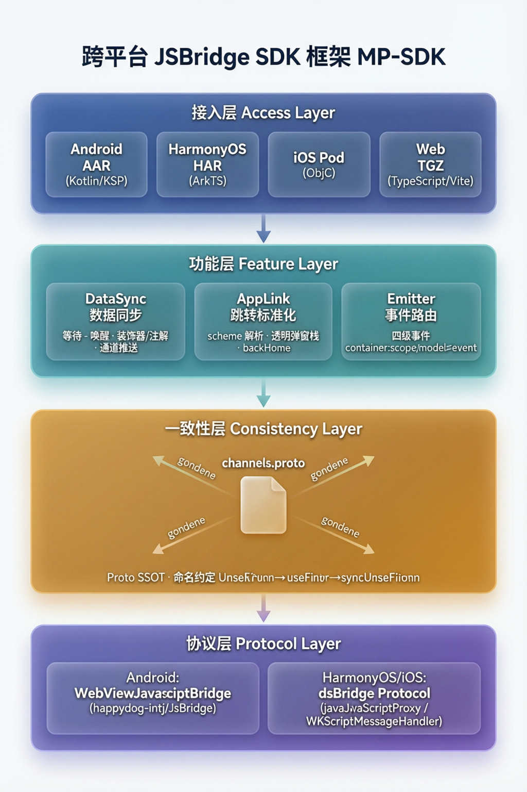

# 简历项目描述：MP-SDK 跨平台 JSBridge 框架

## 一句话描述

> 主导设计并落地了一套基于 Proto SSOT 的四端（Android / iOS / HarmonyOS / Web）JSBridge SDK，通过 codegen 自动生成四端代码 + 编译期注解扫描，将新通道接入成本从 3 天降至 10 分钟，上线后跨端数据不一致 bug 降为零。

---

## 精简版（简历正文，6 行）

**MP-SDK 跨平台 JSBridge 框架** ｜ 主导设计 & 独立开发 ｜ Android / iOS / HarmonyOS / Web

- 新通道接入从 **3 天降至 10 分钟**，跨端数据不一致 bug **降为零**；基于 Proto3 驱动四端 codegen 自动生成 21 个源文件，改一行 proto 四端代码自动同步
- **Android**：Kotlin + KSP 编译期注解处理，一行 `@NeedsUserInfo` 注解声明数据通道，运行时零反射；自研轻量级 proto 解析器（TS + Kotlin 双版本）
- **HarmonyOS**：ArkTS 装饰器 + hvigor 构建插件，对标 Android KSP 实现声明式集成，一行装饰器自动绑定数据通道
- **AppLink**：统一四端页面跳转协议（`sk://` scheme），屏蔽 Android / iOS / 鸿蒙透明弹窗差异，一行 `jump2Native()` 替代各端冗余路由代码
- **Emitter**：四级事件路由（`container:scope:model:event`）实现跨 WebView 通信，业务方 `on()`/`emit()` 两行 API 搞定，无需自建通信通道
- Web SDK 零运行时依赖，iOS 通过兼容标记实现前端**零改动接入**；SDK 进入稳定维护期成为团队基础设施，lead_info 扩展验证横向复用能力

---

## 架构与模块版（突出产物 + 模块 + 收益）

**MP-SDK 跨平台 JSBridge 框架** ｜ 主导设计 & 独立开发 ｜ Android / iOS / HarmonyOS / Web

**SDK 架构与构建**

- 设计四层架构（接入层→功能层→一致性层→协议层），分层清晰，各端独立演进
- 一键 `npm run build:all` 串联 codegen → 编译 → 打包，自动产出 **AAR / HAR / Pod / TGZ** 四端 SDK 产物，无需手动分端构建
- Proto3 作为唯一真相源，改一行 `.proto`，四端 codegen 自动重新生成 **21 个源文件**（通道常量 / 方法映射 / data class / 类型安全 setter / 注解 / 绑定表）

**功能模块**

- **DataSync（数据同步）**：Android `@NeedsUserInfo` / 鸿蒙 `@NeedsUserInfo` / 前端 `@waitUserInfoSync`，各端一行声明绑定通道，自动等待 Native 数据就绪再发请求，新增通道只改 proto、SDK 零改动
- **AppLink（跳转标准化）**：统一 `sk://` scheme 协议，屏蔽 Android 状态栏 / iOS `.overFullScreen` / 鸿蒙弹窗栈差异，一行 `jump2Native()` 四端一致，消除各端冗余路由代码
- **Emitter（跨 WebView 通信）**：四级事件 `container:scope:model:event` 自动路由，业务方 `on()`/`emit()` 两行 API 实现跨页面通知，无需自建通信通道

**收益**

- 新通道接入：**3 天 → 10 分钟**，改 proto 四端自动同步
- 跨端数据不一致 bug：**降为零**，编译期 proto 保证一致性
- 前端接入 iOS：**零改动**，兼容标记策略无需前端发版配合
- SDK 进入稳定维护期成为团队基础设施，lead_info 扩展验证横向复用能力

---

## 详细版（适合项目展开 / 面试自我介绍）

### 项目背景

金融会员业务从原生向 Hybrid（WebView）转型，面临四端 Bridge 调用不一致、前端拿不到 Native 登录态、页面跳转无统一协议等问题。主导设计 MP-SDK 跨平台 JSBridge 框架，用 Proto 驱动四端代码生成，一次性解决。

### 四层架构总览



```
┌─────────────────────────────────────────────────────────────────┐
│                      接入层（四端产物）                            │
│   Android AAR    │  HarmonyOS HAR  │  iOS Pod(zip)  │  Web TGZ  │
└────────────────────────┬────────────────────────────────────────┘
                         ▼
┌─────────────────────────────────────────────────────────────────┐
│                        功能层（三大模块）                          │
│    DataSync（数据同步）  │  AppLink（跳转标准化）  │  Emitter     │
└────────────────────────┬────────────────────────────────────────┘
                         ▼
┌─────────────────────────────────────────────────────────────────┐
│                    一致性保障（Proto SSOT）                        │
│              channels.proto ── codegen ──▶ 四端代码               │
└─────────────────────────────────────────────────────────────────┘
                         ▼
┌─────────────────────────────────────────────────────────────────┐
│                       协议层（JSBridge 通信）                      │
│   Android: WebViewJavascriptBridge  │  鸿蒙/iOS: dsBridge 协议   │
└─────────────────────────────────────────────────────────────────┘
```

### 核心职责

- **架构设计**：设计四层架构（接入层 → 功能层 → 一致性层 → 协议层），分层清晰，各端独立演进
- **Proto SSOT 体系**：以 `channels.proto` + `custom/*.proto` 为唯一真相源，自研轻量级 proto 解析器（纯 TS / 纯 Kotlin 双版本），各端独立 codegen，proto codegen 产出 **19 个核心源文件**（Android 5 + iOS 6 + 鸿蒙 4 + Web 4），叠加 KSP / 扫描器绑定共 **21 个文件**，proto 改一行四端自动重新生成
- **Android KSP 注解处理器**：实现 `DataSyncSymbolProcessor`，编译期扫描 `@NeedsUserInfo` 等注解，动态读取 `channel-mappings.json` 生成 `DataSyncBindings` 注册表，运行时零反射查表
- **类型安全 codegen**：从 proto 字段定义自动生成 Kotlin `data class` + 类型安全的 setter 扩展函数，集成方传对象而非手搓 JSON 字符串，编译期类型检查
- **鸿蒙 hvigor 插件**：proto codegen 自动生成 `@NeedsUserInfo` / `@NeedsLoanInfo` 等 ArkTS 装饰器 + `DecoratorRegistry` 运行时注册表；hvigor 插件在 preBuild 阶段触发正则扫描器，生成 `DataSyncBindings.ets` 静态绑定表，对标 Android KSP 实现声明式集成
- **Web SDK**：零运行时依赖，TS 装饰器（`@waitUserInfoSync`）+ Axios 拦截器实现自动等待 Native 数据就绪后再发 HTTP 请求；Vite 插件驱动 proto codegen 自动生成装饰器 / 类型 / 配置
- **iOS 兼容策略**：`bridge.js` 同时设置 `__harmony_bridge` 兼容标记，复用现有前端 SDK 的鸿蒙检测逻辑，实现前端**零改动接入 iOS**
- **工具链建设**：一键构建脚本（`npm run build:all`），串联 codegen → 编译 → 打包，产出 AAR / HAR / Pod / TGZ 四端产物

### 数据支撑

| 指标 | 改造前 | 改造后 | 说明 |
|---|---|---|---|
| 新通道接入耗时 | 3 天 | 10 分钟 | 新增 `.proto` 文件，四端 codegen 自动生成注解 / 常量 / data class / setter |
| 跨端数据不一致 bug | 偶发 | **0** | 编译期 KSP 扫描 + 类型安全 setter，通道名 / 方法名 / 字段类型全量由 proto 保证 |
| 前端接入 iOS 改动 | 需前端发版配合 | **零改动** | `__harmony_bridge` 兼容标记策略，iOS 独立上线不阻塞 |
| Web SDK 运行时依赖 | dsBridge + protobuf.js | **0 依赖** | 平台自动检测 + 轻量级 proto 解析器内联 |
| codegen 产出 | 手写四端常量 | **proto codegen 19 文件 + KSP / 扫描器绑定 2 文件** | 注解 / 装饰器 / 通道常量 / 方法映射 / data class / 类型安全 setter / 绑定表 |
| 支持平台数 | — | **4 端** | Android (Kotlin/KSP) / iOS (ObjC) / HarmonyOS (ArkTS) / Web (TS/Vite) |
| 页面跳转代码 | 各端各自实现 | **一行 `jump2Native()` 四端一致** | AppLink 统一 scheme 协议（Android / iOS / 鸿蒙 / Web），前端无需关心平台差异 |
| QA 跨端回归 | 改一端需回归四端 | **单端验证即可** | 协议一致性由 proto + codegen 保证，无需跨端回归 |
| 跨 WebView 通信 | 业务线隔离，无法感知 | **四级事件自动路由** | Emitter 打破 WebView 边界，如商城开会员成功后自动通知商城页面刷新 |

### 三大模块业务价值

#### 模块 1：DataSync — 数据通道一致性

```
proto 定义通道 → codegen 生成注解/常量/setter → 编译期 KSP 扫描 → 运行时自动绑定
```

- **前端**：`@waitUserInfoSync` 装饰器自动等待 Native 数据就绪，无需手动轮询
- **Android/鸿蒙**：`@NeedsUserInfo` 一行注解声明所需通道，KSP/hvigor 自动生成绑定表
- **iOS**：手动传通道数组（ObjC 无元编程能力，保持传统调用）
- **业务效果**：新增通道 10 分钟（改 proto），跨端不一致 bug 降为零

#### 模块 2：AppLink — 跳转协议标准化

```
前端一行调用                        Native 四端一致执行
─────────────────                  ─────────────────────────
jump2Native("                        解析 scheme → 透明弹窗栈管理
  sk://native={                    → backHome 回首页
    pageName='vip',                → 关闭回调栈逐一关闭
    url='https://...',             → 屏蔽各端透明弹窗差异
    title='VIP',
    backHome='1'
  }")
```

- **前端工程师**：只需一行 `jump2Native()` 调用，不关心是 Android / iOS / 鸿蒙
- **SDK 屏蔽各端差异**：
  - Android：透明 Activity 状态栏透传问题（fitsSystemWindows / 状态栏遮挡）
  - iOS：`present overFullScreen` 强制执行（SDK 配置 `modalPresentationStyle` + `crossDissolve`，delegate 不可忽略）
  - 鸿蒙：CustomDialog 取消监听与关闭回调栈管理（链表维护弹窗引用 + 1px 黑色背景策略）
  - **四端**透明弹窗行为对齐，前端无感知
- **开发提效**：消除各端各自实现路由的冗余代码，前端不再写平台判断逻辑
- **QA 提效**：协议一致性由 SDK 保证，四端跳转行为对齐，改一端无需回归其他端

#### 模块 3：Emitter — 跨 WebView 事件路由

```
场景：商城页面(WebView A) → 跳转开会员(WebView B) → 会员开通成功

改造前：WebView B 中会员成功，WebView A（商城）无法感知，用户返回商城看不到状态更新
改造后：
  会员页面 emit('vip:vipbuy:success:two', {orderId:'123'})  ─┐
                     ↓ 通过 JSBridge 路由到 Native            │
                     ↓ Native 解析容器名 → 转发到目标 WebView  │
  商城页面 on('vip:vipbuy:success:two', (data) => {       ─┘
    // 自动刷新商城页面状态
  })
```

- **降低跨前端工程通信难度**：不同业务线（如会员、商城）的前端工程独立部署、运行在不同 WebView 中，
  原本跨工程通信需自建通信通道（如 localStorage 轮询、URL 参数传递），成本高且不可靠。
  Emitter 通过四级事件 `container:scope:model:event` 实现跨 WebView 自动路由，前端只需 `on()` / `emit()`
- **打破业务线隔离**：商城页面跳转开会员，会员开通成功后自动通知商城页面刷新，
  无需业务方自建跨页面通信机制
- **零侵入**：前端只需 `emitter.on()` / `emitter.emit()`，不关心底层 Native 路由逻辑
- **内存安全**：`Set` 去重 + `off()` / `clear()` 完整清理机制，页面销毁时无泄漏

### 技术亮点

1. **Proto SSOT + codegen**：2 份 `.proto`（标准 + 自定义扩展）驱动四端 codegen 产出 19 个核心源文件，叠加 KSP / 扫描器绑定共 21 文件，命名约定 `UserInfo → userInfo → syncUserInfo` 全端统一
2. **编译期安全**：KSP 注解处理器编译期扫描注解生成绑定表，运行时零反射；类型安全 setter 接受 data class 对象，编译期类型检查
3. **声明式集成**：三端（Android / 鸿蒙 / Web）均支持装饰器 / 注解声明数据通道——Android KSP 注解、鸿蒙 ArkTS 装饰器 + 静态绑定、Web TS 装饰器 + Axios 拦截器；iOS 因 ObjC 无元编程能力保持传统调用（手动传通道数组）
4. **零依赖 Web SDK**：不依赖 dsBridge / protobuf.js，平台自动检测，gzip 后 ~6KB
5. **横向扩展验证**：新增 `lead_info.proto`（5 个字段），四端 codegen 自动生成 `@NeedsLeadInfo` + `LeadInfo` data class + `setLeadInfo()` setter，零手动配置
6. **AppLink 平台差异屏蔽**：一行 `jump2Native()` 统一四端跳转（Android / iOS / 鸿蒙 / Web），SDK 内部屏蔽 Android 状态栏透传、iOS `.overFullScreen` 强制执行、鸿蒙 CustomDialog 取消监听等各端透明弹窗差异
7. **跨 WebView 事件路由**：四级事件 `container:scope:model:event` 自动路由，降低跨前端工程通信难度，打破业务线 WebView 隔离（如商城开会员成功后自动通知商城刷新）

---

## 技术栈

| 层 | 技术 |
|---|---|
| Android | Kotlin, KSP (Kotlin Symbol Processing), AGP 9.x, Gradle 9.x, JsBridge |
| iOS | Objective-C, UIKit, .overFullScreen 透明弹窗 |
| HarmonyOS | ArkTS, hvigor 插件, DevEco Studio |
| Web | TypeScript, Vite 5, 装饰器, 零运行时依赖 |
| Codegen | Protocol Buffers (proto3), 自研轻量级解析器（TS + Kotlin 双版本） |
| 构建 | Gradle Task / hvigor Task / Vite Plugin, 一键 `build:all` |
